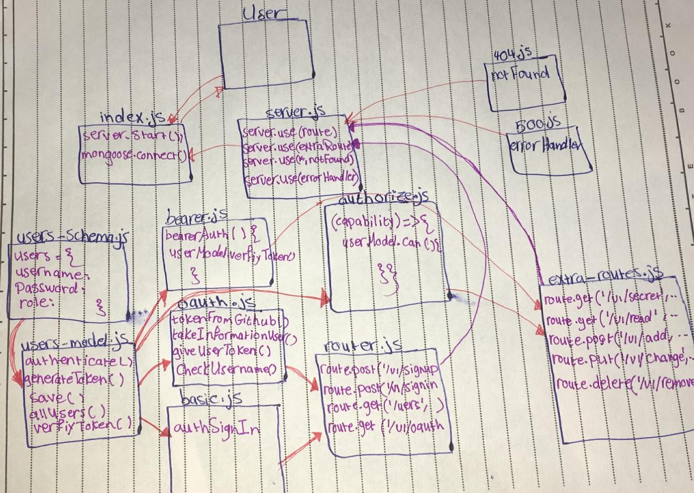

# auth-server

## class 13
- [pull request](https://github.com/sondos-401-advanced-javascript/auth-server/pull/5)
- [github action](https://github.com/sondos-401-advanced-javascript/auth-server/actions)

### test
by using `npm test` and `npm run lint`

### End Point
- /signin 
- /signup
- /users
- /oauth
- /secret
- /read [admin, writer, regular, editor]
- /add [admin, writer, editor]
- /change [admin, editor]
- /remove [admin]

### UML
