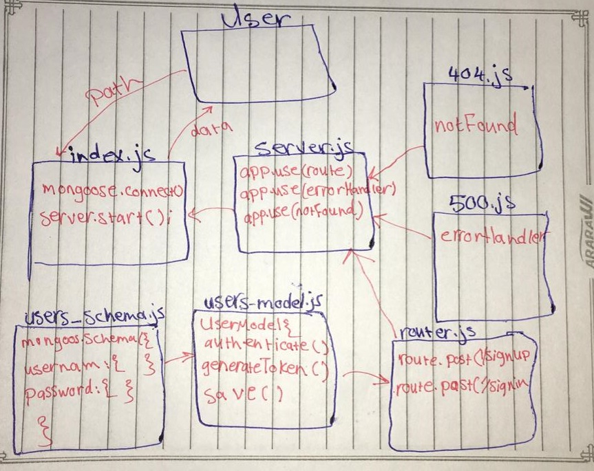

# auth-server

## class 11
- [pull request](https://github.com/sondos-401-advanced-javascript/auth-server/pull/1)
- [github action](https://github.com/sondos-401-advanced-javascript/auth-server/actions)

### test
by using npm test and npm run lint

### End Point
- /signin 
- /signup

### UML
